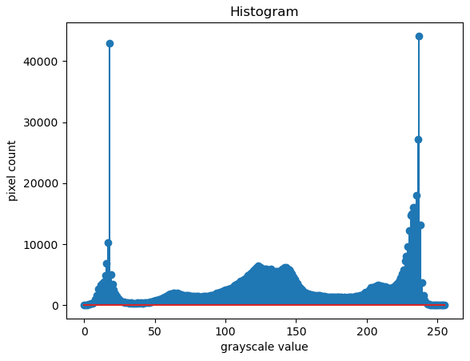

# HISTOGRAM
# Histogram and Histogram Equalization of an image
## Aim
To obtain a histogram for finding the frequency of pixels in an Image with pixel values ranging from 0 to 255. Also write the code using OpenCV to perform histogram equalization.

## Software Required:
Anaconda - Python 3.7

## Algorithm:
### Step1:
import cv2 and matplotlib.pyplot

### Step2:
Read and display the input images

### Step3:
Calculate the Histogram Values using calcHist()

### Step4:
Display the histograms

### Step5:
Calculate and display the equalized image using equalizeHist()

## Program:
```
# Developed By: Ronick Aakshath P
# Register Number: 212222240084

import cv2
import matplotlib.pyplot as plt

# Write your code to find the histogram of gray scale image and color image channels.

Gray_image = cv2.imread('spiderman.jpg')
Color_image = cv2.imread('spiderman-new.jpg')
plt.imshow(Gray_image)
plt.show()
plt.imshow(Color_image)
plt.show()

# Display the histogram of gray scale image and any one channel histogram from color image

hist = cv2.calcHist([Gray_image], [0], None, [256], [0, 256])
hist1 = cv2.calcHist([Color_image], [1], None, [256], [0, 256])
plt.figure()
plt.title("Histogram")
plt.xlabel('grayscale value')
plt.ylabel('pixel count')
plt.stem(hist)
plt.show()
plt.figure()
plt.title("Histogram")
plt.xlabel('color value')
plt.ylabel('pixel count')
plt.stem(hist1)
plt.show()

# Write the code to perform histogram equalization of the image. 

equ = cv2.equalizeHist(Gray_image)
cv2.imshow('Gray Image', Gray_image)
cv2.imshow('Equalized Image', equ)
cv2.waitKey(0)
cv2.destroyAllWindows()

```
## Output:
### Input Grayscale Image and Color Image


### Histogram of Grayscale Image and any channel of Color Image



### Histogram Equalization of Grayscale Image


## Result: 
Thus the histogram for finding the frequency of pixels in an image with pixel values ranging from 0 to 255 is obtained. Also,histogram equalization is done for the gray scale image using OpenCV.
